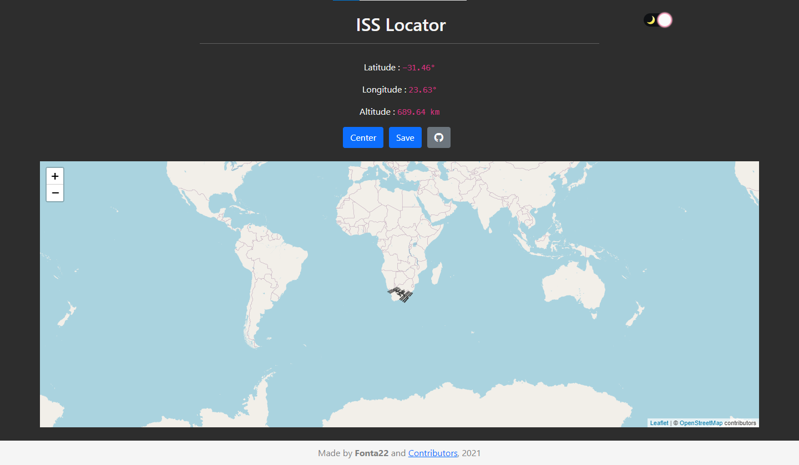

# 📡 ISS-Locator

ISS-Locator uses the `wheretheiss.at` API to **geolocate** the **International Space Station** in real time.
This project was inspired by [Daniel Shiffman](https://github.com/shiffman) and [Where the ISS at](https://wheretheiss.at/).



## Requirements

### [Running via Docker](https://docs.docker.com/get-docker/)

To run via Docker, simply run `docker-compose up` which removes the need to have node installed locally.

### [Node.js](https://nodejs.org/)

JavaScript **runtime**. It is necessary to run the whole project.

## Dependencies

### [Express](https://www.npmjs.com/package/express)

Used for the **server side**.

### [NeDB](https://www.npmjs.com/package/nedb)

Used for the **database**.

### [dotenv](https://www.npmjs.com/package/dotenv)

Used to fetch the **environment files** (`.env`).

To install all the **required libraries**, run the following **command**:

```
npm i
```

## .env configuration

Firstable create a file called `.env` in the **root directory** of the project.

Following the example file [`.env.example`](https://github.com/Fonta22/iss-locator/blob/main/.env.example), create a configuration:

### `HOST`
```
HOST=localhost 
```
Or, if you prefere it:

```
HOST=127.0.0.1
```

### `PORT`

As long as it has got 4 numbers, you can use any. Preferiblely use port 3000, that is the default port for **Express**.

```
PORT=3000
```

### `DB_NAME`

This will be the name for the database file. You can use any name as long as it has the **.db** file extension.

```
DB_NAME=database.db
```

## Serving the app

To start serving ISS-Locator, do the following steps:

- Run `app.js`

- Navigate to `host:port` in your browser. Use the ones selected in the [.env configuration](https://github.com/Fonta22/iss-locator#env-configuration).

## Other libraries used

These are the **libraries** that were used in the HTML. Without them the project would'nt be possible to be made!

There is no need to install them because are already imported with [jsDelivr](https://www.jsdelivr.com/) and [unpkg](https://unpkg.com/) in the **HTML**.

### [Leaflet](https://leafletjs.com/)

Map **interface**.

### [OpenStreetMap](https://www.openstreetmap.org/)

The actual **map engine** that displays the visuals.

### [Bootstrap](https://getbootstrap.com/)

Used for the **styling**.

## API used

[Where the ISS at](https://wheretheiss.at)'s API actually provides all the data used for the project!

You can find all the information on how to use it here: https://wheretheiss.at/w/developer

## Contributors

<a href="https://github.com/Fonta22/iss-locator/graphs/contributors">
   
</a>
